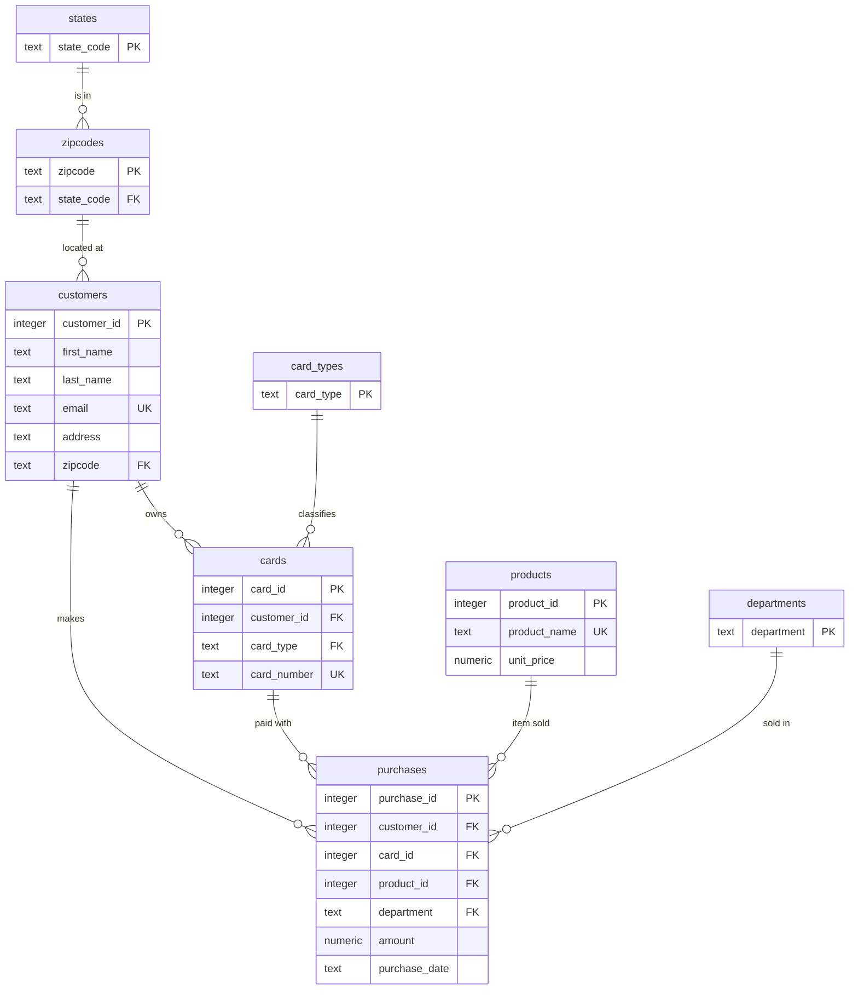

# 02 — SQLite: From a Flat CSV to a Normalized Database

A hands-on walkthrough. We start with one messy spreadsheet-shaped file
(`../example_data.csv`), decide how the data *should* be organized, build a
schema for it in SQLite, load the file into that schema, and then query it.

By the end you will have run:

- `CREATE TABLE` with data types, primary keys, foreign keys, and `CHECK`
  constraints — [sql/01_schema.sql](sql/01_schema.sql)
- a staging-table load from CSV and `INSERT … SELECT` transforms into the
  normalized tables — [sql/02_load.sql](sql/02_load.sql)
- a single **rebuild** script that recreates everything from scratch —
  [rebuild.sql](rebuild.sql)
- `SELECT *`, joins, subqueries, aggregates, and date-range queries —
  [sql/03_queries.sql](sql/03_queries.sql)
- the data-quality checks that justify the schema —
  [sql/90_data_quality.sql](sql/90_data_quality.sql)

This lecture builds on the [Data Modeling Glossary](../01_overview/README.md);
terms like *functional dependency*, *3NF*, *referential integrity*, and
*point-in-time snapshot* are used here as defined there.

---

## 0. Prerequisites

You need the `sqlite3` command-line tool (version 3.37+ for the `.import` options
used here; 3.51 is what these files were tested on).

```bash
sqlite3 --version
```

All commands below assume you are **in this directory**:

```bash
cd Lectures/02_sqlite
```

The load script refers to the CSV as `../example_data.csv`, so the working
directory has to be `02_sqlite/` for the relative path to resolve.

New to running SQL from the command line? Read
[running_sqlite.md](running_sqlite.md) first — it explains the `sqlite3` shell,
the `.` (dot) commands used in these files, and how `sqlite3 store.db <
script.sql` redirection works.

---

## 1. Look at the raw data

```bash
head -3 ../example_data.csv
```

```
id,first_name,last_name,email,cc_type,cc_number,purchase_dept,purchase_amount,address,zipcode,state,prod_name,purchase_data
1,Leighton,Pavelka,lpavelka0@time.com,solo,633492725057411162,Garden,89.99,63 Columbus Parkway,80126,CO,Electric Pressure Cooker,3/9/2026
2,Gan,Quilligan,gquilligan1@about.me,visa,4041597961507,Music,14.99,1809 John Wall Lane,30066,GA,Winter Knit Beanie,10/8/2025
```

1,000 rows. Each row mixes together facts about **five different things**:

| Column(s) | Really describes a… |
| :-------- | :------------------ |
| `first_name`, `last_name`, `email`, `address`, `zipcode` | customer |
| `state` | location (the state a zipcode is in) |
| `cc_type`, `cc_number` | payment card |
| `prod_name`, `purchase_amount` | product in a catalog |
| `purchase_dept`, `purchase_amount`, `purchase_data` | a single purchase event |

`purchase_data` is a misspelling in the source; it holds a **date** in `M/D/YYYY`
text form.

### Why the flat table is a problem

Storing it exactly as delivered means the same fact is repeated on many rows.
That produces the three classic anomalies (glossary §3):

- **Update anomaly** — a product's price is written on every row that sold it.
  Change the price and you must find and change *every* copy; miss one and the
  data now contradicts itself.
- **Insertion anomaly** — you cannot record a new product, a new card, or a new
  customer until they appear on a purchase row.
- **Deletion anomaly** — delete the only purchase a customer ever made and you
  also erase that the customer, their address, and their card ever existed.

Normalization fixes this by storing each fact **once**, in a table whose primary
key that fact depends on.

---

## 2. Decide the schema (the normalization exercise)

Before designing anything, **ask the data questions**. The queries are in
[sql/90_data_quality.sql](sql/90_data_quality.sql); run them against a
staging-only copy:

```bash
sqlite3 explore.db
```
```sql
CREATE TABLE staging_raw (
    id TEXT, first_name TEXT, last_name TEXT, email TEXT, cc_type TEXT,
    cc_number TEXT, purchase_dept TEXT, purchase_amount TEXT, address TEXT,
    zipcode TEXT, state TEXT, prod_name TEXT, purchase_data TEXT
);
.mode csv
.import --skip 1 ../example_data.csv staging_raw
.read sql/90_data_quality.sql
.quit
```

What those checks tell us:

| Question | Answer in this data | Design consequence |
| :------- | :------------------ | :----------------- |
| Is `id` unique? | yes (1000/1000) | usable as a primary key |
| Does an `email` ever have two names? | no | `email` identifies a person → `customers` |
| Does a `zipcode` ever map to two `state`s? | no | **`zipcode → state`** → a `zipcodes` table |
| Does a `cc_number` ever have two `cc_type`s? | no | **`cc_number → cc_type`** → `card_type` lives on the card |
| Is a `cc_number` shared by two people? | no | one card → one customer (1:N) |
| Does a `prod_name` ever have two prices? | no | **`prod_name → price`** → `products.unit_price` |
| Does a `prod_name` appear in two departments? | **yes — 181 products do** | `department` is **not** a product attribute; it belongs to the **purchase** |
| Do the dates all look like `M/D/YYYY`? | yes | safe to parse by splitting on `/` |

The department finding is the interesting one. Our first instinct is "a product
belongs to a department," but the data says otherwise: the *same* product is sold
under different departments on different purchases. So `department` is an
attribute of the **purchase event**, not of the product. This is the kind of call
you can only make by looking.

### The resulting tables



**Design notes** (all spelled out in comments in
[sql/01_schema.sql](sql/01_schema.sql)):

- **Data types.** SQLite has five storage classes — `NULL`, `INTEGER`, `REAL`,
  `TEXT`, `BLOB` — and *dynamic typing*: the declared type is a *preference*
  (a "type affinity"), not a hard rule. We still declare types (`INTEGER`,
  `TEXT`, `NUMERIC`) because they document intent and drive affinity. Money uses
  `NUMERIC`; **dates use `TEXT` in ISO `YYYY-MM-DD`** so that string order equals
  chronological order and the built-in `date()`/`strftime()` functions work.
- **Primary keys.** Lookup tables (`states`, `card_types`, `departments`) use the
  value itself as a natural key. `zipcodes` uses the zip. `customers`, `cards`,
  `products`, `purchases` use a surrogate `INTEGER PRIMARY KEY` (which in SQLite
  aliases the internal `rowid`). `email`, `card_number`, and `product_name` are
  kept as `UNIQUE` secondary candidate keys.
- **Foreign keys / relationships.** Every "describes a…" column became a foreign
  key to the table that owns that fact. `ON DELETE CASCADE` from `customers` to
  `cards` (a card cannot outlive its owner); `ON DELETE RESTRICT` into
  `purchases` (you cannot delete a customer/product/card that has history).
- **`CHECK` constraints.** `unit_price >= 0`, `amount >= 0`, a rough e-mail
  shape, a two-letter uppercase state code, and an ISO-shape guard on
  `purchase_date` (`GLOB '????-??-??'` — note `?` not `_`; `_` is a `LIKE`
  wildcard, not a `GLOB` one).
- **Deliberate duplication.** `purchases.amount` will equal
  `products.unit_price` for every row in *this* file. We store it anyway: it is a
  **point-in-time snapshot** (glossary §6) of what was actually charged, and it
  must not move if the catalog price later changes.

---

## 3. Build it: the rebuild script

One command recreates the entire database from the CSV:

```bash
rm -f store.db
sqlite3 store.db ".read rebuild.sql"
```

Expected tail of the output:

```
states,47
zipcodes,774
card_types,13
departments,22
customers,1000
cards,1000
products,775
purchases,1000
== verification ==
1000|28275.04|1000
== rebuild complete ==
```

[rebuild.sql](rebuild.sql) just sets `.bail on` and `.read`s the two build files
in order, then runs verification:

1. **[sql/01_schema.sql](sql/01_schema.sql)** — `PRAGMA foreign_keys = ON`, drop
   every object (children before parents), `CREATE TABLE` ×8, `CREATE INDEX` ×7,
   and one `CREATE VIEW purchase_details` that re-joins everything back into the
   wide shape.
2. **[sql/02_load.sql](sql/02_load.sql)** — the load, in stages:
   - **A. Staging.** `CREATE TABLE staging_raw` with *every column `TEXT` and no
     constraints* — it must accept the file no matter how dirty it is.
   - **B. Import.** `.mode csv` then `.import --skip 1 ../example_data.csv
     staging_raw` (the `--skip 1` drops the header row).
   - **C. Parents first.** `INSERT … SELECT DISTINCT` populates `states`,
     `card_types`, `departments`, `zipcodes` so the children have something to
     reference.
   - **D–F.** `customers`, `cards`, `products` (the last one `GROUP BY prod_name`
     to collapse duplicates and take the single price).
   - **G. The fact table.** `INSERT INTO purchases … SELECT … FROM staging_raw
     JOIN customers … JOIN cards … JOIN products …` — joining on the natural keys
     (`email`, `card_number`, `product_name`) to translate them into surrogate
     ids. A small CTE converts `'M/D/YYYY'` → `'YYYY-MM-DD'` by splitting on the
     slashes and `printf('%04d-%02d-%02d', …)`.
   - **H. Drop staging.** So nobody queries the un-normalized copy by accident.
3. **Verification** — `PRAGMA foreign_key_check` (returns nothing when clean) and
   a round-trip check that the row count and revenue total still match the file
   (`1000` rows, `28275.04`).

It is safe to re-run at any time; step 1 drops everything first.

---

## 4. Query it

Open the database and work through [sql/03_queries.sql](sql/03_queries.sql) a
block at a time:

```bash
sqlite3 store.db
```
```sql
.mode box
.headers on
.read sql/03_queries.sql      -- run them all, or paste blocks individually
```

The file is organized to match the topics for this lecture:

| § | Topic | Examples |
| :- | :---- | :------- |
| 1 | **`SELECT *`** | whole lookup tables; `SELECT *` with `LIMIT`; the `purchase_details` view; reading structure from `sqlite_master` |
| 2 | filtering & sorting | `WHERE`, `LIKE`, `IN`, `BETWEEN`, `DISTINCT`, `ORDER BY` |
| 3 | **joins** | inner join across 4 tables; join + `GROUP BY` (revenue by state); `LEFT JOIN` (every department, even unused); `row_number()` window for "most expensive item per department" |
| 4 | **subqueries** | scalar (`> (SELECT avg(amount) …)`); `IN (SELECT …)`; derived table in `FROM`; correlated subquery; `NOT EXISTS` (products never sold) |
| 5 | **aggregates** | `count`, `sum`, `avg`, `min`, `max`; `GROUP BY`; `HAVING` vs. `WHERE`; all three together |
| 6 | **date ranges** | `BETWEEN` two dates; half-open `>= … AND < …` for month boundaries; `strftime('%Y-%m', …)` monthly buckets; "last 90 days before the max date"; day-of-week histogram |
| 7 | extras | `CASE` bucketing; `WITH` (CTE); `EXPLAIN QUERY PLAN`; a foreign-key rejection; `PRAGMA foreign_key_check` |

A few queries to try first:

```sql
-- top 10 products by revenue, with how many times each sold (JOIN + GROUP BY)
SELECT pr.product_name,
       count(*)                 AS times_sold,
       round(sum(pu.amount), 2) AS revenue
FROM purchases pu
JOIN products pr ON pr.product_id = pu.product_id
GROUP BY pr.product_id
ORDER BY revenue DESC
LIMIT 10;

-- customers who spent more than the average customer (subquery)
SELECT c.email, round(sum(pu.amount), 2) AS spent
FROM purchases pu
JOIN customers c ON c.customer_id = pu.customer_id
GROUP BY c.customer_id
HAVING sum(pu.amount) > (
    SELECT avg(t.total) FROM (
        SELECT sum(amount) AS total FROM purchases GROUP BY customer_id
    ) t
)
ORDER BY spent DESC;

-- revenue per month (date range + aggregate)
SELECT strftime('%Y-%m', purchase_date) AS month,
       count(*)                         AS n,
       round(sum(amount), 2)            AS revenue
FROM purchases
GROUP BY month
ORDER BY month;
```

---

## 5. Exercises

1. **Break a constraint on purpose.** Try to insert a purchase with a
   `product_id` that does not exist. Try a negative `amount`. Try a
   `purchase_date` of `'2026-13-40'`. Read each error message.
2. **`zipcode → state` as a real dependency.** Add a row to `zipcodes` for a zip
   that already exists but a different state. What happens, and which constraint
   caught it?
3. **Model repeat customers.** The source has one purchase per person. Sketch (or
   write) an `INSERT` that adds a *second* purchase for an existing customer,
   reusing their `customer_id` and `card_id`. Nothing in the schema needs to
   change — why not?
4. **A new normal-form question.** Is `address → zipcode` a functional
   dependency in this data? Write the check. If it holds, does it change the
   design?
5. **Denormalize deliberately.** Add a `product_name` column to a copy of
   `purchases` so the "top products" query needs no join. Write the statement
   that would keep it in sync if a product were renamed. What did you trade away?
6. **Date range, half-open vs. `BETWEEN`.** Rewrite query 6a using `>=`/`<` and
   explain when the `BETWEEN` version would be wrong (hint: timestamps, not just
   dates).

---

## 6. Where things live

See [README.md](README.md) for the full file listing. The pieces this
walkthrough refers to:

```
02_sqlite/
├── sqlite_walkthrough.md         ← you are here
├── README.md                     ← folder overview + file index
├── running_sqlite.md             ← the sqlite3 shell, dot commands, redirection
├── rebuild.sql                   ← one command: schema + load + verify
├── encryption_and_passwords.md   ← SQLite has no built-in crypto; how to hash
│                                   passwords and encrypt column values in Python
└── sql/
    ├── 01_schema.sql             ← CREATE TABLE / INDEX / VIEW, all constraints
    ├── 02_load.sql               ← staging import + INSERT…SELECT transforms
    ├── 03_queries.sql            ← worked SELECT / JOIN / subquery / aggregate / date examples
    └── 90_data_quality.sql       ← the functional-dependency checks behind the schema
```

> **Aside on the `cc_number` column.** The source file stores card numbers in the
> clear. That is acceptable for synthetic teaching data and nothing else. See
> [encryption_and_passwords.md](encryption_and_passwords.md) for what a real
> system does: SQLite ships no encryption or password hashing, so it is all
> application-side — worked Python examples for Argon2id password hashing,
> Fernet / AES-GCM field encryption, blind-index search, and whole-file
> SQLCipher.

`store.db` and `explore.db` are build artifacts — regenerate them with
`rebuild.sql`; do not commit them.
